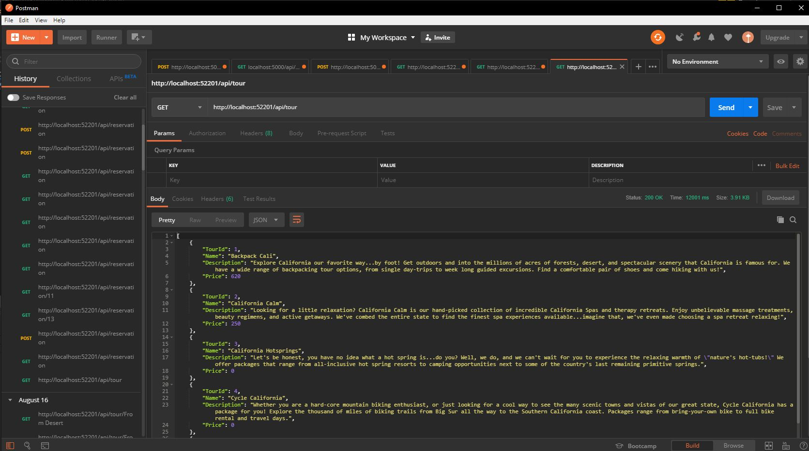

# ExploreCalifornia
Web solution using .Net Web API 2.2

This is a playground for creating Web API using .Net 2.2 following **Building Web APIs with ASP.NET Web API 2.2** on LinkedIn Learning by * Jonathan "J" Tower *.

### The following are covered in this project:
  * Convention-based routing
  * Binding the code to an HTTP request
  * Validating models
  * Using attributes to route requests
  * Customizing attribute routes
  * Data serialization and model binding
  * Error handling
  * Using exception filters and exception loggers
  - API documentation and testing
  - Securing the  API

### Screenshots of the project
1. List of tours
  
2. Tour By Id
  
3. List of reservations
  
4. Reservation By Id
  
5. API Documentation using Microsoft.AspNet.WebApi.HelpPage nugget package 
  
6. API Documentation using Microsoft.AspNet.WebApi.HelpPage nugget package
  
7. API Documentation using Microsoft.AspNet.WebApi.HelpPage nugget package
  
8. API Documentation using Swagger and Swashbuckle nugget package
   
9. API Documentation using Swagger and Swashbuckle nugget package
   

